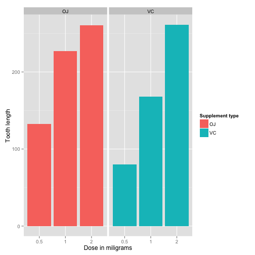

Statistical Inference: Peer Assessment 2
----------------------------------------

##  Basic Inferential Data Analysis  

###  Data Analysis
Analyze the ToothGrowth data in R datasets package.
### Visible settings

```r
echo = TRUE
options(scipen = 1)
```

### 1. Load the ToothGrowth data and perform some basic exploratory data analyses


```r
### Load the dataset
library(datasets)

### Perfrom some basic exploratory data analyses

### look at the dataset variables
data(ToothGrowth)
head(ToothGrowth)
```

```
##    len supp dose
## 1  4.2   VC  0.5
## 2 11.5   VC  0.5
## 3  7.3   VC  0.5
## 4  5.8   VC  0.5
## 5  6.4   VC  0.5
## 6 10.0   VC  0.5
```

```r
### convert variable dose from numeric to factor
dose <- as.factor(ToothGrowth$dose)
supp <- as.factor(ToothGrowth$supp)
### number of dataset rows
nrow(ToothGrowth)
```

```
## [1] 60
```

```r
### number of dataset columns
ncol(ToothGrowth)
```

```
## [1] 3
```

### 2. Provide a basic summary of the data.  


```r
### Summary of all variables
summary(ToothGrowth)
```

```
##       len        supp         dose      
##  Min.   : 4.20   OJ:30   Min.   :0.500  
##  1st Qu.:13.07   VC:30   1st Qu.:0.500  
##  Median :19.25           Median :1.000  
##  Mean   :18.81           Mean   :1.167  
##  3rd Qu.:25.27           3rd Qu.:2.000  
##  Max.   :33.90           Max.   :2.000
```

```r
### split of cases between different dose levels and delivery methods
table(dose,supp)
```

```
##      supp
## dose  OJ VC
##   0.5 10 10
##   1   10 10
##   2   10 10
```

```r
library(ggplot2)
### Plot Graph
ggplot(data=ToothGrowth, aes(x=as.factor(dose), y=len, fill=supp)) +
    geom_bar(stat="identity",) +
    facet_grid(. ~ supp) +
    xlab("Dose in miligrams") +
    ylab("Tooth length") +
    guides(fill=guide_legend(title="Supplement type"))
```

 

Based on the above figure, there is a positive correlation between the tooth length and the dose levels of Vitamin C, for both delivery methods.  

### 3. Use confidence intervals and hypothesis tests to compare tooth growth by supp and dose.  

95% confidence intervals for two variables and the intercept are below shown data: 


```r
fit <- lm(len ~ dose + supp, data=ToothGrowth)
confint(fit)
```

```
##                 2.5 %    97.5 %
## (Intercept)  6.704608 11.840392
## dose         8.007741 11.519402
## suppVC      -5.889905 -1.510095
```

The confidence intervals are a different set of data and parameters of the linear model many times, 95% of the time, the coefficient estimations will be in these ranges. The effect of the dose can also be identified using regression analysis. 


```r
summary(fit)
```

```
## 
## Call:
## lm(formula = len ~ dose + supp, data = ToothGrowth)
## 
## Residuals:
##    Min     1Q Median     3Q    Max 
## -6.600 -3.700  0.373  2.116  8.800 
## 
## Coefficients:
##             Estimate Std. Error t value Pr(>|t|)    
## (Intercept)   9.2725     1.2824   7.231 1.31e-09 ***
## dose          9.7636     0.8768  11.135 6.31e-16 ***
## suppVC       -3.7000     1.0936  -3.383   0.0013 ** 
## ---
## Signif. codes:  0 '***' 0.001 '**' 0.01 '*' 0.05 '.' 0.1 ' ' 1
## 
## Residual standard error: 4.236 on 57 degrees of freedom
## Multiple R-squared:  0.7038,	Adjusted R-squared:  0.6934 
## F-statistic: 67.72 on 2 and 57 DF,  p-value: 8.716e-16
```
The model explains 70% of the variance in the data.

From the reuslt, both 0.5 and 1.0 dosage tests can reject the null hypothesis and be confident that there is significant impact on the tooth length between OJ vs VC. For 2.0 dosage, the p-value suggests keeping the null hypothesis.

When delivery method are not considered for p-value, it is purely calculated on different dosage. Reading the p-value from the result, all three dosage comparison can have their null hypothesis rejected.

### 4. State your conclusions and the assumptions needed for your conclusions


```r
###Compute P-values and for confidence intervals supp and dose.
groups<-as.data.frame(split(ToothGrowth$len,list(supp,dose)))
rnames<-vector()
c<-0
for ( i in 1:5 ) for ( j in (i+1):6 ) { c<-c+1; rnames[c]<-paste(as.character(names(groups)[i]),as.character(names(groups)[j]),sep="~") }
htest<-matrix(data=NA,nrow=length(rnames),ncol=3,byrow=TRUE,dimnames=list(rnames,c("P-value","Conf int", "Conf int")))
c<-0
for ( i in 1:5 ) for ( j in (i+1):6 )  {
    c<-c+1;
    htest[c,1]<-t.test(groups[,i],groups[,j])$p.value;
    htest[c,2]<-t.test(groups[,i],groups[,j])$conf.int[1];
    htest[c,3]<-t.test(groups[,i],groups[,j])$conf.int[2]
}
htest
```

```
##                    P-value   Conf int     Conf int
## OJ.0.5~VC.0.5 6.358607e-03   1.719057   8.78094273
## OJ.0.5~OJ.1   8.784919e-05 -13.415634  -5.52436564
## OJ.0.5~VC.1   4.601033e-02  -7.008109  -0.07189097
## OJ.0.5~OJ.2   1.323784e-06 -16.335241  -9.32475943
## OJ.0.5~VC.2   7.196254e-06 -17.263522  -8.55647805
## VC.0.5~OJ.1   3.655207e-08 -17.921493 -11.51850747
## VC.0.5~VC.1   6.811018e-07 -11.265712  -6.31428796
## VC.0.5~OJ.2   1.362140e-11 -20.618183 -15.54181684
## VC.0.5~VC.2   4.681577e-08 -21.901512 -14.41848801
## OJ.1~VC.1     1.038376e-03   2.802148   9.05785175
## OJ.1~OJ.2     3.919514e-02  -6.531443  -0.18855747
## OJ.1~VC.2     9.652612e-02  -7.564334   0.68433359
## VC.1~OJ.2     2.361074e-07 -11.720333  -6.85966738
## VC.1~VC.2     9.155603e-05 -13.054267  -5.68573334
## OJ.2~VC.2     9.638516e-01  -3.798070   3.63807046
```
### Based on the above data, the conclusions are:
1.By ignoring the supplement types, there is a significant difference in tooth length between the dose levels, with higher doses resulting in longer teeth.

2.By considering dose levels and supplement types, OJ creates longer teeth than VC at dose levels of 0.5 mg and 1.0 mg, but at dose levels of 2.0 mg, there is no significant difference in teeth length between the two supplement types.

### Assumptions:
1. We assume that the populations are independent. 

2. The measurements were unaware of the dosages and supplement types.

*** Important Note: *** Please see the below links for reports

rpubs --> http://rpubs.com/srikanthkamineni/36150

github --> https://github.com/srikanthkamineni/Statistical-Inference-Project2.git
